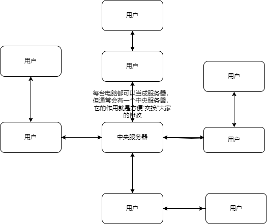

# Git

## 简介

Git是分布式版本控制系统



分布式版本控制系统，重点在于分布。分布的含义不是说每台计算机上只留有版本库的一部分。恰恰相反，分布的含义是每台计算机上都还有一个完整的版本库。这个时候，你的修改仅仅需要提交给本地的版本库进行保存就可以了。

不同于集中式版本控制系统的“中央服务器”，分布式版本控制系统可以通过推送版本库，实现不同的计算机之间的版本共享。什么意思呢？就是说对于同一个文件A，如果两个人同时对A文件进行了修改，最新的版本应该都保存在各自的计算机中，想要实现协同开发，只需要将各自的最新版本库推送给对方，就可以得到最新的版本库了。

但是这里面有个问题，就是一个团队很大的情况下，大家都去修改，到底找谁同步版本库，不乱套了嘛。而且，大的开发项目也不是简单的两台计算机之间的版本互推就可以得到完整的版本库的。所以，分布式版本控制系统中通常也会有一台充当“中央服务器”的计算机，大家都把版本推送到这台计算机上，而需要同步的人只需同步这一台固定的计算机就可以。

所谓的分布式管理中的“中央服务器”是用来“交换意见”，或者说充当中介作用的。每一台计算机通过和这台固定的中介交换意见以后，都会拥有完整的版本库。

## Windows安装Git

windows上使用Git，可以从Git官网下载安装程序，[默认安装](https://git-scm.com/downloads)。
安装完成后找到`Git Bash`完成下列设置

``` Git
git config --global user.name "Your Name"
git config --global user.email "email@example.com"
```

Git是分布式版本控制系统，所以每个机器都需自报家门。

## 常用基本命令

* git init
  * 建立版本库

    ``` Git
    # 初始化本地仓库，在当前目录下生成 .git 文件夹
    $ git init
    ```

* git add
  * 把要提交的东西添加到暂存区。commit时将会把暂存区的内容提交。

    ``` Git
    # 指定文件添加到暂存区
    $ git add [文件路径]
    # 添加当前目录所有修改，新增，删除的文件到暂存区
    $ git add -A
    $ git add --all
    ```

* git commit
  * 把暂存区的所有内容提交到当前分支。

    ``` Git
    # 把暂存区中的文件提交到本地仓库中并添加描述信息
    $ git commit -m "提交的描述信息"
    ```

* git branch
  * 操作Git分支的命令

    ``` Git
    # 列出本地的所有分支，当前所在分支以 "*" 标出
    $ git branch
    # 列出本地的所有分支并显示最后一次提交，当前所在分支以 "*" 标出
    $ git branch -v
    # 创建新分支，新的分支基于上一次提交建立
    $ git branch 分支名
    # 切换分支
    $ git checkout 分支名
    # 创建新分支并切换
    $ git checkout -b 分支名
    # 修改分支名称
    # 如果不指定原分支名称则为当前所在分支
    $ git branch -m 原分支名称 新分支名称
    # 强制修改分支名称
    $ git branch -M 原分支名称 新分支名称
    # 删除指定的本地分支
    $ git branch -d 分支名称
    # 强制删除指定的本地分支
    $ git branch -D 分支名称
    ```

* git clone
  * 克隆远程存储库到本地（克隆的是整个远程库）

    ``` Git
    # 默认在当前目录下创建和版本库名相同的文件夹并下载版本到该文件夹下
    $ git clone git@github.com:probieLuo/LearnArea
    # -b 指定要克隆的分支，默认是master分支
    $ git clone 远程仓库网址 -b 分支名称 本地目录
    ```

* git config
  * 用来配置Git的相关参数

    ``` Git
    # 查看配置信息
    # --local：仓库级，--global：全局级，--system：系统级
    $ git config <--local | --global | --system> -l

    # 查看当前生效的配置信息
    $ git config -l

    # 编辑配置文件
    # --local：仓库级，--global：全局级，--system：系统级
    $ git config <--local | --global | --system> -e

    # 添加配置项
    # --local：仓库级，--global：全局级，--system：系统级
    $ git config <--local | --global | --system> --add <name> <value>

    # 获取配置项
    $ git config <--local | --global | --system> --get <name>

    # 删除配置项
    $ git config <--local | --global | --system> --unset <name>

    # 配置提交记录中的用户信息
    $ git config --global user.name <用户名>
    $ git config --global user.email <邮箱地址>

    # 更改Git缓存区的大小
    # 如果提交的内容较大，默认缓存较小，提交会失败
    # 缓存大小单位：B，例如：524288000（500MB）
    $ git config --global http.postBuffer <缓存大小>

    # 调用 git status/git diff 命令时以高亮或彩色方式显示改动状态
    $ git config --global color.ui true

    # 配置可以缓存密码，默认缓存时间15分钟
    $ git config --global credential.helper cache

    # 配置密码的缓存时间
    # 缓存时间单位：秒
    $ git config --global credential.helper 'cache --timeout=<缓存时间>'

    # 配置长期存储密码
    $ git config --global credential.helper store
    ```

  * Git三个配置文件
    1. 仓库级的配置文件：在仓库的 .git/.gitconfig，该配置文件只对所在的仓库有效。
    2. 全局配置文件：Mac 系统在 ~/.gitconfig，Windows 系统在 C:\Users\<用户名>\.gitconfig。
    3. 系统级的配置文件：在 Git 的安装目录下（Mac 系统下安装目录在 /usr/local/git）的 etc 文件夹中的 gitconfig。

* git fetch
  * 更新本地仓库

    ``` Git
    # 1.
    # 从远程的origin仓库的master分支下载代码到本地的origin master
    $ git fetch origin master
    # 比较本地的仓库和远程仓库的区别
    $ git log -p master.. origin/master
    # 把远程下载下来的代码合并到本地仓库，远程的和本地的合并
    $ git merge origin/master

    # 2.
    # 从远程的origin仓库的master分支下载到本地并新建一个分支temp
    $ git fetch origin master:temp
    # 比较master分支和temp分支的不同
    $ git diff temp
    # 合并temp分支到master分支
    $ git merge temp
    # 删除临时分支temp
    $ git branch -d temp
    ```

* git log
  
    ``` Git
    # 打印从第一次提交到指定的提交的记录
    $ git log <commit ID>
    # 打印所有的提交记录
    $ git log
    ```

* git merge
  * 分支合并

    ``` Git
    # 把指定的分支合并到当前所在的分支下，并自动进行新的提交
    $ git merge 分支名称
    ```

* git mv

    ``` Git
    # 重命名指定的文件或者文件夹
    $ git mv <源文件/文件夹> <目标文件/文件夹>
    ```

* git pull
  * 从远程仓库获取最新版本并合并到本地。 首先会执行 git fetch，然后执行 git merge，把获取的分支的 HEAD 合并到当前分支。

    ``` Git
    # 从远程仓库获取最新版本。
    $ git pull <远程主机名> <远程分支名>:<本地分支名>
    ```

* git push
  * 把本地仓库的提交推送到远程仓库。

    ``` Git
    # 把本地仓库的分支推送到远程仓库的指定分支
    $ git push <远程仓库的别名> <本地分支名>:<远程分支名>

    # 删除指定的远程仓库的分支
    $ git push <远程仓库的别名> :<远程分支名>
    $ git push <远程仓库的别名> --delete <远程分支名>
    #将本地的master分支推送到origin主机，同时指定origin为默认主机，后面就可以不加任何参数使用git push了。
    $ git push -u origin master
    #如果当前分支只有一个追踪分支，那么主机名都可以省略。
    $ git push
    ```

* git remote
  * 操作远程库。

    ``` Git
    # 列出已经存在的远程仓库
    $ git remote

    # 列出远程仓库的详细信息，在别名后面列出URL地址
    $ git remote -v
    $ git remote --verbose

    # 添加远程仓库
    $ git remote add <远程仓库的别名> <远程仓库的URL地址>

    # 修改远程仓库的别名
    $ git remote rename <原远程仓库的别名> <新的别名>

    # 删除指定名称的远程仓库
    $ git remote remove <远程仓库的别名>

    # 修改远程仓库的 URL 地址
    $ git remote set-url <远程仓库的别名> <新的远程仓库URL地址>
    ```

* git tag
  * 操作标签的命令。

    ``` Git
    # 打印所有的标签
    $ git tag

    # 添加轻量标签，指向提交对象的引用，可以指定之前的提交记录
    $ git tag <标签名称> [<commit ID>]

    # 添加带有描述信息的附注标签，可以指定之前的提交记录
    $ git tag -a <标签名称> -m <标签描述信息> [<commit ID>]

    # 切换到指定的标签
    $ git checkout <标签名称>

    # 查看标签的信息
    $ git show <标签名称>

    # 删除指定的标签
    $ git tag -d <标签名称>

    # 将指定的标签提交到远程仓库
    $ git push <远程仓库的别名> <标签名称>

    # 将本地所有的标签全部提交到远程仓库
    $ git push <远程仓库的别名> –tags
    ```
